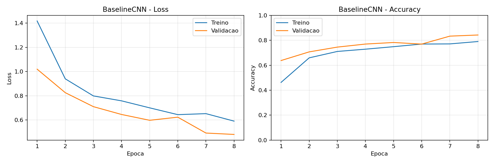
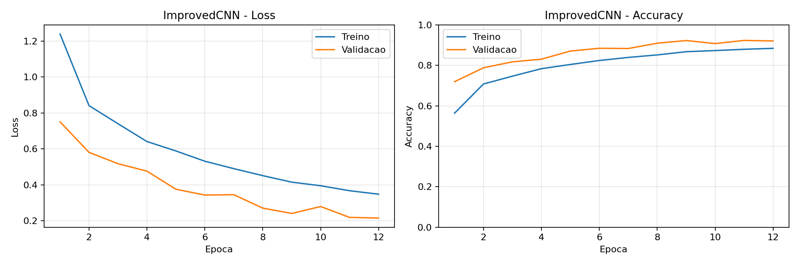
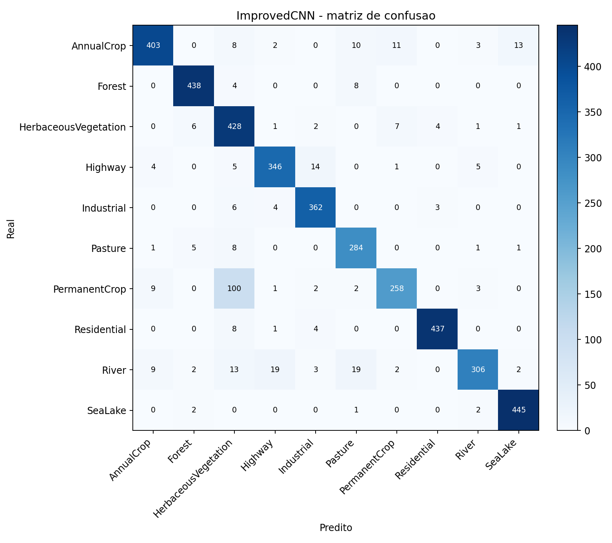
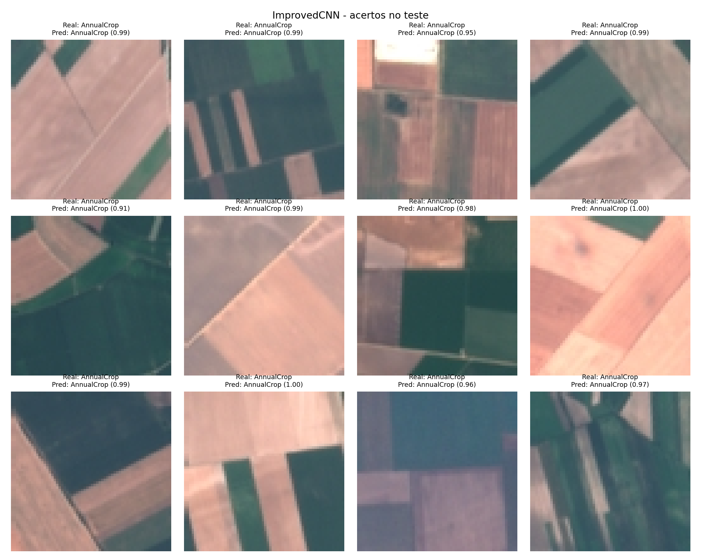
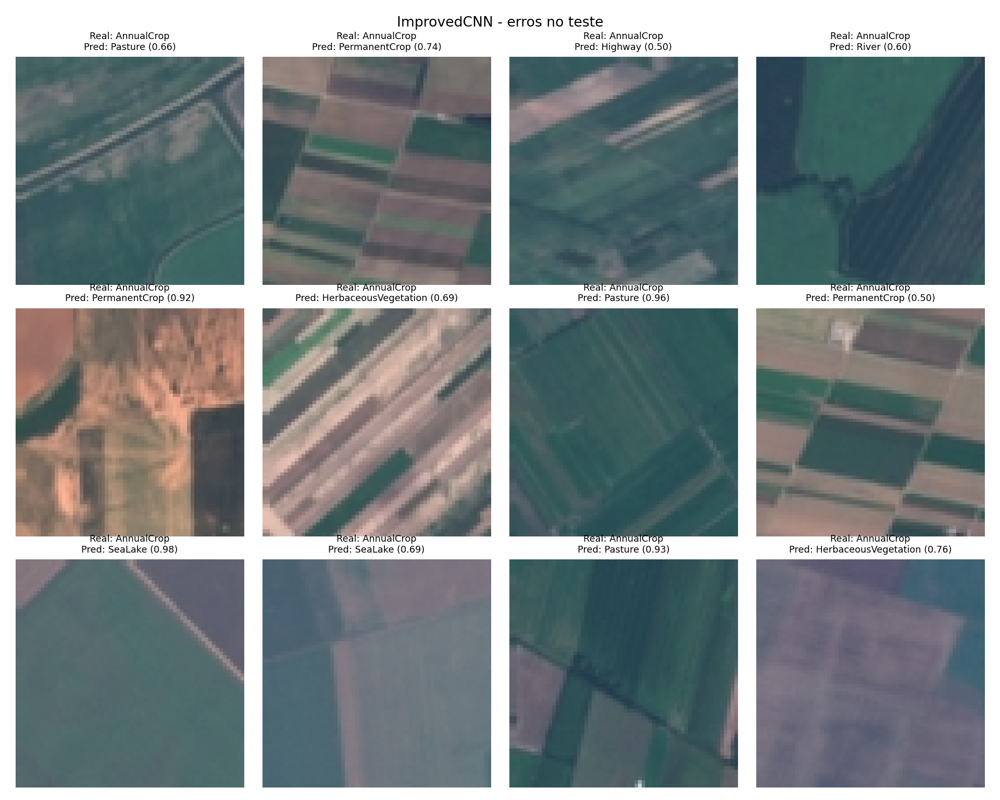

# Classificação de Uso e Cobertura do Solo com CNNs do Zero

Solução de Visão Computacional com PyTorch para a Global Solution FIAP 2026, no contexto de Indústria Espacial, usando imagens RGB de sensoriamento remoto do dataset `./EuroSAT_RGB`.

## Identificação

| Campo | Informação |
|---|---|
| Nome da solução | Orbital Land Classifier |
| Nome descritivo | Plataforma Cloud de Classificação de Uso do Solo via Sensoriamento Remoto Orbital |
| Disciplina | Applied Computer Vision |
| Tema | Global Solution 2026 — Indústria Espacial |
| Turma | 2026/1 — manhã |
| Integrantes | Rafael Carvalho Mattos — RM99874<br>Luiza Cristina Silva — RM99367<br>Rafael Autieri dos Anjos — RM550885<br>Levy Nascimento Junior — RM98655 |
| Professor(a) | Preencher, se aplicável |
| Vídeo | Preencher link do YouTube antes da entrega |
## Contexto da Global Solution

A Global Solution 2026 tem como tema a Indústria Espacial. Dentro da disciplina Applied Computer Vision, este projeto constrói uma solução de classificação de imagens capaz de reconhecer categorias de uso e cobertura do solo em recortes RGB de sensoriamento remoto.

A aplicação é compatível com fluxos de observação da Terra: imagens orbitais ou aéreas podem ser recortadas, pré-processadas e classificadas automaticamente para apoiar monitoramento territorial, análise ambiental, agricultura, infraestrutura e planejamento urbano.

## Problema Escolhido

**Nome do problema:** classificação de uso e cobertura do solo em imagens RGB de sensoriamento remoto.

**Tipo de tarefa:** classificação supervisionada de imagens.

Cada entrada é uma imagem RGB `64x64` e a saída é uma classe entre as 10 categorias detectadas no diretório `EuroSAT_RGB`:

| Classe | Interpretação operacional |
|---|---|
| `AnnualCrop` | Áreas de cultivo anual |
| `Forest` | Áreas florestais |
| `HerbaceousVegetation` | Vegetação herbácea |
| `Highway` | Rodovias e infraestrutura linear |
| `Industrial` | Zonas industriais |
| `Pasture` | Pastagens |
| `PermanentCrop` | Cultivos permanentes |
| `Residential` | Áreas residenciais |
| `River` | Rios e cursos d'água |
| `SeaLake` | Mares, lagos e grandes corpos d'água |

A classificação é adequada porque as classes dependem de padrões visuais locais e espaciais, como textura de vegetação, organização urbana, formas lineares de rodovias e rios, e diferenças entre áreas agrícolas, naturais e construídas.

## Conexão com Indústria Espacial e ODS

A conexão espacial é tecnicamente plausível porque o dataset contém imagens RGB compatíveis com sensoriamento remoto/cobertura do solo. Como não há metadados locais sobre sensor, órbita ou satélite específico, o projeto trata a solução como compatível com pipelines de observação da Terra, sem afirmar origem orbital específica além do que foi verificado no repositório.

ODS relacionados:

- **ODS 13 — Ação Climática:** apoia monitoramento ambiental e análise de mudanças de cobertura do solo.
- **ODS 15 — Vida Terrestre:** apoia análise de florestas, vegetação, pastagens e áreas agrícolas.
- **ODS 9 — Indústria, Inovação e Infraestrutura:** usa IA e sensoriamento remoto como apoio tecnológico para análise territorial e infraestrutura.

Usuários prováveis incluem equipes de sensoriamento remoto, analistas ambientais, pesquisadores, órgãos públicos e empresas que operam sistemas de observação da Terra.

## Dataset `EuroSAT_RGB`

A inspeção real do diretório `./EuroSAT_RGB` está documentada em `reports/EuroSAT_RGB_dataset_inspection.md`.

Resumo verificado:

- Total de imagens: `27.000`.
- Formato: `.jpg`.
- Modo de cor: `RGB`.
- Dimensão: `64x64` pixels.
- Estrutura: uma pasta por classe, compatível com `torchvision.datasets.ImageFolder`.
- Split prévio: não encontrado.
- Imagens corrompidas: `0`.
- Duplicatas exatas por SHA-256: `0` grupos encontrados.
- Artefatos prontos dentro de `EuroSAT_RGB`: nenhum notebook, script, modelo, peso, log ou metadado encontrado.

Quantidade por classe:

| Classe | Imagens |
|---|---:|
| `AnnualCrop` | 3.000 |
| `Forest` | 3.000 |
| `HerbaceousVegetation` | 3.000 |
| `Highway` | 2.500 |
| `Industrial` | 2.500 |
| `Pasture` | 2.000 |
| `PermanentCrop` | 2.500 |
| `Residential` | 3.000 |
| `River` | 2.500 |
| `SeaLake` | 3.000 |
| **Total** | **27.000** |

O projeto usa `EuroSAT_RGB` somente como fonte de dados. Nenhuma arquitetura, notebook, script, peso ou métrica anterior foi copiada do dataset. As CNNs deste repositório foram implementadas e treinadas do zero em PyTorch.

## Preparação dos Dados

O split foi gerado em `data/processed/` com metadados CSV, sem copiar fisicamente as imagens.

Configuração:

- Proporção: `70%` treino, `15%` validação, `15%` teste.
- Seed: `42`.
- Estratégia: split estratificado por classe.
- Fonte das imagens: `EuroSAT_RGB/`.
- Manifesto: `data/processed/dataset_manifest.csv`.
- Arquivos de split: `data/processed/train.csv`, `data/processed/val.csv`, `data/processed/test.csv`.

Contagens por split:

| Split | Imagens |
|---|---:|
| Treino | 18.900 |
| Validação | 4.050 |
| Teste | 4.050 |
| **Total** | **27.000** |

Normalização calculada somente sobre o treino:

```json
{
  "mean": [0.3438271126, 0.3799947054, 0.407612037],
  "std": [0.2024812323, 0.1369397151, 0.1156126249]
}
```

Transforms de treino:

1. `Resize((64, 64))`
2. `RandomHorizontalFlip(p=0.5)`
3. `RandomVerticalFlip(p=0.5)`
4. `RandomRotation(degrees=15)`
5. `RandomApply(ColorJitter, p=0.5)`
6. `ToTensor()`
7. `Normalize(mean, std)`

Transforms de validação, teste e inferência:

1. `Resize((64, 64))`
2. `ToTensor()`
3. `Normalize(mean, std)`

## Stack Técnica

- Python
- PyTorch
- torchvision
- Pillow
- NumPy
- pandas
- matplotlib
- scikit-learn
- Jupyter Notebook

## Arquiteturas CNN

As duas CNNs foram criadas e treinadas do zero. O projeto não usa `torchvision.models`, transfer learning, modelos pré-treinados ou pesos externos.

### `BaselineCNN`

Arquivo: `src/models/baseline_cnn.py`

Objetivo: estabelecer uma referência simples.

Resumo:

- Entrada: imagem RGB `3x64x64`.
- Saída: 10 logits, um por classe.
- Blocos: 3 blocos `Conv2d + ReLU + MaxPool2d`.
- Pooling final: `AdaptiveAvgPool2d((4, 4))`.
- Classificador: `Flatten`, `Dropout(0.25)`, `Linear(2048, 256)`, `ReLU`, `Dropout(0.25)`, `Linear(256, 10)`.
- Parâmetros treináveis: `620.362`.

### `ImprovedCNN`

Arquivo: `src/models/improved_cnn.py`

Objetivo: aumentar capacidade e generalização.

Resumo:

- Entrada: imagem RGB `3x64x64`.
- Saída: 10 logits, um por classe.
- Estágios: 4 estágios com duas convoluções por estágio.
- Blocos internos: `Conv2d + BatchNorm2d + ReLU`.
- Regularização: `Dropout2d` nos mapas de características e `Dropout(0.35)` no classificador.
- Pooling final: `AdaptiveAvgPool2d((1, 1))`.
- Classificador: `Flatten`, `Linear(256, 128)`, `ReLU`, `Linear(128, 10)`.
- Parâmetros treináveis: `1.207.402`.

## Treinamento

Relatório completo: `reports/experiment_report.md`.

Configuração usada:

| Item | Valor |
|---|---|
| Dataset | `EuroSAT_RGB` |
| Split | `data/processed` |
| Seed | `42` |
| Device registrado | `cpu` |
| Entrada | `64x64` RGB |
| Batch size | `256` |
| Loss | `CrossEntropyLoss` |
| Otimizador | `AdamW` |
| Learning rate | `0.001` |
| Weight decay | `0.0001` |
| Épocas `BaselineCNN` | `8` |
| Épocas `ImprovedCNN` | `12` |
| Critério de melhor modelo | maior accuracy de validação |
| Meta de referência | `88%` de accuracy no teste |

## Resultados

| Modelo | Parâmetros | Melhor época | Train loss | Train acc | Val loss | Val acc | Test loss | Test acc | Meta 88% |
|---|---:|---:|---:|---:|---:|---:|---:|---:|---|
| `BaselineCNN` | 620.362 | 8 | 0.5910 | 78,99% | 0.4810 | 84,22% | 0.5041 | 82,42% | Não atingida |
| `ImprovedCNN` | 1.207.402 | 11 | 0.3673 | 87,92% | 0.2192 | 92,30% | 0.2400 | 91,53% | Atingida |

O melhor modelo foi `ImprovedCNN`, com `91,53%` de accuracy no teste. A meta de referência de `88%` foi atingida.

Gráficos e matrizes:

- Curva `BaselineCNN`: `reports/figures/baseline_accuracy_loss.png`
- Curva `ImprovedCNN`: `reports/figures/improved_accuracy_loss.png`
- Matriz `BaselineCNN`: `reports/confusion_matrices/baseline_confusion_matrix.png`
- Matriz `ImprovedCNN`: `reports/confusion_matrices/improved_confusion_matrix.png`







Relatório de classificação do melhor modelo:

| Classe | Precision | Recall | F1-score | Support |
|---|---:|---:|---:|---:|
| `AnnualCrop` | 0.9460 | 0.8956 | 0.9201 | 450 |
| `Forest` | 0.9669 | 0.9733 | 0.9701 | 450 |
| `HerbaceousVegetation` | 0.7379 | 0.9511 | 0.8311 | 450 |
| `Highway` | 0.9251 | 0.9227 | 0.9239 | 375 |
| `Industrial` | 0.9354 | 0.9653 | 0.9501 | 375 |
| `Pasture` | 0.8765 | 0.9467 | 0.9103 | 300 |
| `PermanentCrop` | 0.9247 | 0.6880 | 0.7890 | 375 |
| `Residential` | 0.9842 | 0.9711 | 0.9776 | 450 |
| `River` | 0.9533 | 0.8160 | 0.8793 | 375 |
| `SeaLake` | 0.9632 | 0.9889 | 0.9759 | 450 |

## Comparação Técnica

`BaselineCNN` é mais compacta e rápida, mas apresentou menor capacidade para separar classes visualmente parecidas. A accuracy de teste ficou em `82,42%`, abaixo da meta de referência.

`ImprovedCNN` usa mais profundidade, `BatchNorm2d`, `Dropout2d` e pooling adaptativo global. A arquitetura teve melhor generalização no mesmo split, reduziu o erro de teste para `0.2400` e alcançou `91,53%` de accuracy.

Principais confusões:

| Modelo | Classe real | Classe predita | Ocorrências |
|---|---|---|---:|
| `BaselineCNN` | `PermanentCrop` | `Highway` | 57 |
| `BaselineCNN` | `HerbaceousVegetation` | `Highway` | 52 |
| `BaselineCNN` | `River` | `Highway` | 50 |
| `ImprovedCNN` | `PermanentCrop` | `HerbaceousVegetation` | 100 |
| `ImprovedCNN` | `River` | `Highway` | 19 |
| `ImprovedCNN` | `River` | `Pasture` | 19 |

A principal limitação restante do melhor modelo é a confusão entre `PermanentCrop` e `HerbaceousVegetation`, coerente com a similaridade visual entre áreas agrícolas e vegetação em imagens RGB pequenas.

## Análise de Acertos e Erros

Figuras geradas:

- Acertos: `reports/predictions/correct_predictions.png`
- Erros: `reports/predictions/wrong_predictions.png`





Exemplos de acertos do `ImprovedCNN`:

- `EuroSAT_RGB/AnnualCrop/AnnualCrop_100.jpg`: real `AnnualCrop`, predito `AnnualCrop`, confiança `0.9910`.
- `EuroSAT_RGB/AnnualCrop/AnnualCrop_1005.jpg`: real `AnnualCrop`, predito `AnnualCrop`, confiança `0.9853`.
- `EuroSAT_RGB/AnnualCrop/AnnualCrop_1010.jpg`: real `AnnualCrop`, predito `AnnualCrop`, confiança `0.9505`.

Exemplos de erros do `ImprovedCNN`:

- `EuroSAT_RGB/AnnualCrop/AnnualCrop_101.jpg`: real `AnnualCrop`, predito `Pasture`, confiança `0.6558`.
- `EuroSAT_RGB/AnnualCrop/AnnualCrop_1234.jpg`: real `AnnualCrop`, predito `PermanentCrop`, confiança `0.7386`.
- `EuroSAT_RGB/AnnualCrop/AnnualCrop_1266.jpg`: real `AnnualCrop`, predito `Highway`, confiança `0.5015`.

Esses erros indicam que algumas imagens de áreas agrícolas podem ter textura, cor ou organização espacial semelhantes a pastagens, cultivos permanentes, rios ou infraestrutura linear.

## Demonstração Funcional

Notebook principal:

```text
notebooks/04_model_evaluation_demo.ipynb
```

O notebook:

- carrega `models/best_model.pt`;
- carrega `models/class_names.json`;
- recria a arquitetura `ImprovedCNN`;
- aplica o mesmo pré-processamento usado no teste;
- faz predição em imagens novas ou amostras do teste;
- exibe classe prevista, confiança e top-3 probabilidades;
- mostra exemplos de acertos e erros;
- não retreina o modelo.

## Dataset: amostra versionada e download completo

Para manter o repositório leve, **o dataset completo (`EuroSAT_RGB/`, 27.000 imagens, ~144 MB) não é versionado** (veja `.gitignore`). O repositório inclui apenas uma **amostra** dentro de `EuroSAT_RGB/`, suficiente para rodar o notebook de demonstração em um clone limpo.

Para reproduzir o treinamento do zero é preciso baixar o EuroSAT (RGB) completo e colocá-lo em `EuroSAT_RGB/` na raiz, mantendo uma pasta por classe:

- Fonte oficial: https://github.com/phelber/EuroSAT (versão RGB, `.jpg`, 64x64).
- Após extrair, confirme as 10 pastas de classe e 27.000 imagens no total.

## Como Executar

Pré-requisito para o treino completo: ter o diretório `EuroSAT_RGB/` com o dataset completo na raiz do projeto (ver seção acima). A demonstração já roda com a amostra versionada.

Crie o ambiente e instale dependências:

```bash
python3 -m venv .venv
source .venv/bin/activate
python -m pip install --upgrade pip
python -m pip install -r requirements.txt
```

Gere ou valide os metadados do dataset:

```bash
python -m src.data.prepare_dataset
```

Reproduza o treinamento registrado:

```bash
python scripts/train_models.py --batch-size 256 --epochs-baseline 8 --epochs-improved 12 --force-cpu
```

Para permitir uso automático de `cuda` ou `mps`, remova `--force-cpu`.

Execute a demonstração:

```bash
jupyter notebook notebooks/04_model_evaluation_demo.ipynb
```

Ou execute o notebook em linha de comando, se `nbconvert` estiver disponível:

```bash
jupyter nbconvert --to notebook --execute --inplace notebooks/04_model_evaluation_demo.ipynb --ExecutePreprocessor.timeout=300 --ExecutePreprocessor.kernel_name=python3
```

## Estrutura do Repositório

```text
.
├── EuroSAT_RGB/                         # dataset original, usado como fonte de imagens
├── data/processed/                      # manifestos, splits e estatísticas
├── models/                              # checkpoints e métricas
├── notebooks/04_model_evaluation_demo.ipynb
├── reports/
│   ├── EuroSAT_RGB_dataset_inspection.md
│   ├── dataset_pipeline_implementation.md
│   ├── experiment_report.md
│   ├── figures/
│   ├── confusion_matrices/
│   └── predictions/
├── scripts/train_models.py
├── src/
│   ├── data/prepare_dataset.py
│   ├── dataset.py
│   ├── transforms.py
│   └── models/
│       ├── baseline_cnn.py
│       └── improved_cnn.py
├── requirements.txt
└── README.md
```

## Artefatos Principais

- `models/baseline_best.pt`
- `models/improved_best.pt`
- `models/best_model.pt`
- `models/class_names.json`
- `models/metrics.json`
- `reports/figures/baseline_accuracy_loss.png`
- `reports/figures/improved_accuracy_loss.png`
- `reports/confusion_matrices/baseline_confusion_matrix.png`
- `reports/confusion_matrices/improved_confusion_matrix.png`
- `reports/predictions/correct_predictions.png`
- `reports/predictions/wrong_predictions.png`

## Limitações

- As imagens têm baixa resolução (`64x64`), o que limita detalhes finos.
- Algumas classes são visualmente semelhantes, principalmente `PermanentCrop`, `HerbaceousVegetation`, `Pasture` e `AnnualCrop`.
- A classe `Pasture` tem menos imagens que as classes maiores (`2.000` contra `3.000`).
- O treinamento registrado foi feito em `cpu`, com custo maior de tempo.
- Não há metadados locais de sensor, órbita ou satélite específico no diretório `EuroSAT_RGB`.
- O README mantém campos de integrantes/RM e vídeo como pendentes porque essas informações não estão disponíveis nos arquivos do repositório.

## Melhorias Futuras

- Ajustar hiperparâmetros e scheduler de learning rate.
- Testar arquiteturas próprias adicionais, mantendo a restrição de treinamento do zero.
- Investigar técnicas específicas para reduzir confusão entre cultivos e vegetação.
- Usar validação cruzada estratificada para medir estabilidade.
- Integrar o classificador a um pipeline real de recortes geoespaciais.
- Adicionar interface ou API somente em etapa futura, se solicitado.
- Registrar metadados de origem das imagens quando disponíveis.

## Vídeo de Demonstração

Link: preencher com o link do YouTube antes da entrega.
